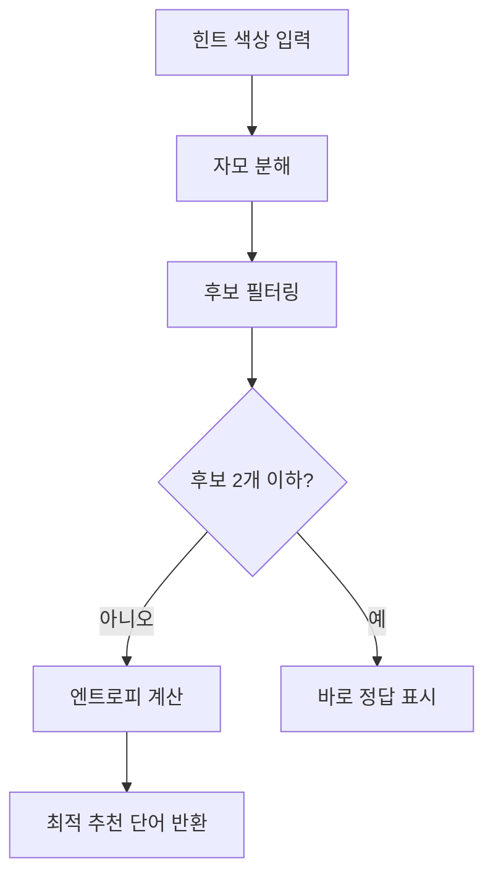

# 카카오 단어맞추기 도우미

카카오톡 단어맞추기 게임에서 힌트 색상을 입력하면 가능한 정답을 AI가 추려주는 웹 앱.

라이브: https://kakao-wordle-helper.vercel.app

## 왜 만들었나

카카오톡 단어맞추기는 Wordle과 비슷하지만 한국어다. 한국어는 자모 단위로 힌트가 주어지기 때문에 영어 Wordle 솔버를 그대로 쓸 수 없다. "재수"를 입력하면 ㅈ·ㅏ·ㅣ·ㅅ·ㅜ 다섯 자모로 분해되어 각각 초록·노랑·회색으로 색이 붙는다. 이 구조를 제대로 이해하는 도우미가 없어서 직접 만들었다.

## 핵심 설계: 두벌식 자모 분해

일반적인 한글 분리와 다르게, 이 앱은 **두벌식 키스트로크 기준**으로 자모를 분해한다. `ㅐ`는 키보드에서 ㅏ+ㅣ 두 번 눌러야 입력되므로 2자모로 계산한다. 받침 `ㄺ`은 ㄹ+ㄱ이므로 2자모. 이 방식으로 분해했을 때 정확히 5자모가 되는 단어만 게임에 등장한다.

```
재수 → ㅈ ㅏ ㅣ ㅅ ㅜ  (5자모)
가방 → ㄱ ㅏ ㅂ ㅏ ㅇ  (5자모)
배추 → ㅂ ㅏ ㅣ ㅊ ㅜ  (5자모)
```

힌트를 받으면 Shannon 엔트로피 기반으로 후보군을 가장 많이 좁혀주는 다음 추측 단어를 계산해 추천한다.



단어 목록은 3,055개로 두벌식 5자모 조건을 모두 검증했다.

## 빠른 시작

```bash
npm install
npm run dev
# http://localhost:3000
```

## 버전 히스토리

| 버전 | 날짜 | 변경 내용 |
|------|------|----------|
| v1.6 | 2026-04-23 | A+B 리워드 시스템 — 보석 컬렉션 + 단어 도감 + 컬렉션 탭 |
| v1.5 | 2026-04-23 | 단어 목록 대폭 확장 (3,261 → 16,360개, pecab 사전 기반) |
| v1.4 | 2026-04-23 | 도우미 직접 입력 방식 변경 + 동료 등 누락 단어 추가 (3,261개) |
| v1.3 | 2026-04-21 | 복합모음 패턴 단어 추가 — 재수·배추·재미 등 (166→3,055개) |
| v1.2 | 2026-04-21 | 단어 목록 대규모 확장 (166→379개) |
| v1.1 | 2026-04-21 | 단어 목록 초기 확장 (166→281개) |
| v1.0 | 2026-04-01 | 최초 출시 — 두벌식 자모 분해 + 엔트로피 추천 |
